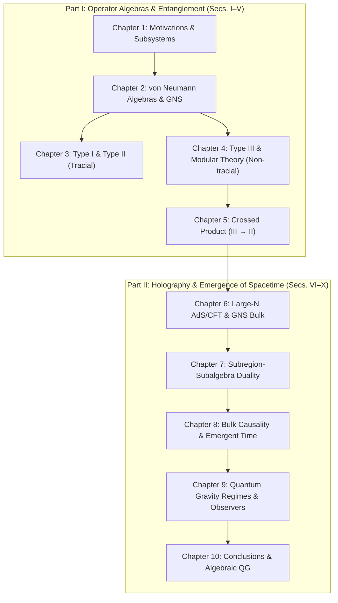

# A Pedagogical Companion to Hong Liu's *Lectures on Entanglement, von Neumann Algebras, and Emergence of Spacetime*

> **Target Paper:** Hong Liu, *Lectures on entanglement, von Neumann algebras, and emergence of spacetime* (arXiv:[2510.07017](https://arxiv.org/abs/2510.07017) [hep-th], 119 pages).

This companion is designed to be read side-by-side with Hong Liu's lectures. It walks through every mathematical definition from scratch, proves intermediate steps rather than asserting them, and computes worked numerical examples you can check by hand.

---

## 📖 Available Formats for Reading & Accessibility

To make these notes accessible on any device, screen reader, or operating environment, multiple formats are provided:

| Format | File / Location | Features & Best For |
| :--- | :--- | :--- |
| **🌐 Interactive Web Reader** | [`index.html`](index.html) | **Zero setup, instant reading**. Responsive layout, live full-text search across all 10 chapters, dark / sepia / light themes, font-size adjuster, dyslexia-friendly font option, screen-reader optimized (ARIA landmarks, WCAG AAA contrast), MathJax 3 rendering. |
| **📄 Publication PDF (117 Pages)** | [`main.pdf`](main.pdf) | **Print & Desktop Reading**. Latin Modern typography, `microtype` optical alignment, running headers/footers, clickable bookmarks & TOC, and styled callout boxes. |
| **📝 Markdown Edition** | [`markdown/`](markdown/) | **Terminal, Obsidian & Plain Text**. Individual chapter files (`01_introduction.md` through `10_conclusions.md`) plus [`full_companion.md`](markdown/full_companion.md). |
| **⚙️ LaTeX Source Files** | [`main.tex`](main.tex), [`chapters/`](chapters/) | Clean TeX sources with modular chapter structure and upgraded [`preamble.tex`](preamble.tex). |

---

## 🗺️ Chapter Roadmap & Syllabus



### [Chapter 1: Sec. I — Introduction and Motivations](markdown/01_introduction.md)
* **The Core Problem:** How classical spacetime geometry and causal order emerge from quantum degrees of freedom as $G_N \to 0$ ($N \to \infty$).
* **Why Hilbert Space Factorization Fails:** Why $\mathcal{H} \ne \mathcal{H}_R \otimes \mathcal{H}_L$ in gauge theories, thermodynamic limits, and local quantum field theories across an entangling surface.
* **The Fundamental Example:** $N$ entangled Bell pairs in the $N \to \infty$ limit under a finite-energy restriction; divergence of entanglement entropy $S_R = N \log 2$ and non-separability of the GNS Hilbert space.
* **The Operational Fix:** Defining subsystems via observable algebras $\mathcal{M} \subset B(\mathcal{H})$ rather than spatial tensor factorizations.

### [Chapter 2: Sec. II — Introduction to von Neumann Algebras](markdown/02_von_neumann_algebras.md)
* **Foundations:** Bounded operators on Hilbert space $B(\mathcal{H})$, adjoints, self-adjoint observables.
* **Topologies on Operators:** Norm topology vs. Weak/Strong operator topologies; $C^*$-algebras vs. von Neumann algebras.
* **Von Neumann Double Commutant Theorem:** $\mathcal{M} = \mathcal{M}''$ and commutant $\mathcal{M}'$ as the operational complement (spacelike commutativity).
* **Centers & Factors:** The center $\mathcal{Z}(\mathcal{M}) = \mathcal{M} \cap \mathcal{M}'$; factors ($\mathcal{Z} = \mathbb{C}\mathbf{1}$) as indivisible building blocks.
* **Murray–von Neumann Classification:** Projection equivalence, relative dimensions, and the complete classification into Types $\mathrm{I}_n, \mathrm{I}_\infty, \mathrm{II}_1, \mathrm{II}_\infty, \mathrm{III}$.
* **The GNS Construction:** Building a representation $\pi_\omega$ and Hilbert space $\mathcal{H}_\omega$ purely from an abstract algebra $\mathcal{A}$ and a state $\omega$.

### [Chapter 3: Sec. III — Type I and II Algebras & Entanglement](markdown/03_type_I_and_II.md)
* **Algebraic Density Operators:** Solving $\operatorname{tr}(A \rho_\mathcal{M}) = \langle\Psi|A|\Psi\rangle$ internally without partial traces.
* **Type I Factors & Direct Sums:** Agreement with ordinary partial trace $\rho_R = \operatorname{Tr}_L |\Psi\rangle\langle\Psi|$; classical superselection sectors in lattice gauge theory ($S = S_{\text{Shannon}} + \sum p_\alpha S_\alpha$).
* **Type II Factors:** Renormalized traces $\operatorname{tr}(\mathbf{1}) = 1$; well-defined density operators $\rho_\mathcal{M}$ and relative entropies despite the absence of minimal projections.

### [Chapter 4: Sec. IV — Type III Algebras & Modular Theory](markdown/04_type_III_modular_theory.md)
* **The Obstruction:** Type III algebras possess no trace ($\operatorname{tr}(\mathbf{1}) = \infty$), rendering standard density matrices impossible.
* **Tomita–Takesaki Modular Theory:** Cyclic and separating vectors $\Psi$; the conjugate-linear polar decomposition $S_\Psi = J_\Psi \Delta_\Psi^{1/2}$.
* **Modular Flow & Thermal Equilibrium:** Modular operator $\Delta_\Psi$, modular Hamiltonian $K = -\log \Delta_\Psi$, and the Kubo–Martin–Schwinger (KMS) condition at $\beta = 1$.
* **Connes Cocycle & Relative Modular Theory:** Comparing states via relative modular operators $\Delta_{\Phi|\Psi}$ and the spatial cocycle $u_{t}(\Phi, \Psi)$.
* **Classification of Type III Subtypes:** Connes invariant $S(\mathcal{M})$ and types $\mathrm{III}_0, \mathrm{III}_\lambda \; (\lambda \in (0,1)), \mathrm{III}_1$.

### [Chapter 5: Sec. V — Crossed Product by Modular Group](markdown/05_crossed_product.md)
* **The Crossed Product:** $\widehat{\mathcal{M}} = \mathcal{M} \rtimes_{\sigma} \mathbb{R}$ on $\mathcal{H} \otimes L^2(\mathbb{R})$.
* **Algebra Promotion:** Transforming any Type III algebra into a Type $\mathrm{II}_\infty$ algebra by coupling to an auxiliary quantum degree of freedom (observer's clock $\hat{q}, \hat{p}$).
* **Density Operator & Generalized Entropy:** Semiclassical states $\widehat{\Phi} = \Phi \otimes g(q)$; explicit formula $S_{\widehat{\mathcal{M}}} = -S(\Phi\|\Psi) - \langle\hat{q}\rangle + S_{\text{observer}}$.

### [Chapter 6: Sec. VI — AdS/CFT Duality in the Large-$N$ Limit](markdown/06_adscft_large_N.md)
* **Large-$N$ Factorization:** Smeared single-trace operators $\mathcal{S}$ generating a generalized free field algebra.
* **Bulk Emergence from GNS:** The large-$N$ GNS representation $(\mathcal{S}, \omega_0)$ is canonically isomorphic to the bulk Fock space of free fields on curved spacetime.
* **HKLL Reconstruction:** Smearing boundary operators over spacelike regions to reconstruct bulk local operators $\phi(X) = \int K(X; x) \mathcal{O}(x) \, \mathrm{d}x$.
* **Thermofield Double & Black Hole Interiors:** $\mathcal{S}_R' = \mathcal{S}_L$ in the TFD state; emergence of the 2-sided eternal black hole ER bridge vs. generic firewalls.

### [Chapter 7: Sec. VII — Subregion-Subalgebra Duality](markdown/07_subregion_subalgebra_duality.md)
* **The Duality Thesis:** A bulk causal diamond $a$ corresponds to a von Neumann subalgebra $\mathcal{A}_{\text{bulk}}(a) = \mathcal{M}(R)$ on the boundary.
* **Entanglement Wedge Reconstruction:** The bulk entanglement wedge $W_E(R)$ is reconstructed from the boundary region algebra $\mathcal{M}(R)''$.
* **The JLMS Theorem:** Equivalence of boundary and bulk relative entropies: $S(\rho_R \| \sigma_R) = S(\rho_{W_E} \| \sigma_{W_E})$.
* **Quantum Error Correction:** Holographic encoding as an approximate QEC code with protected bulk interior logical qubits.

### [Chapter 8: Sec. VIII — Emergence of Spacetime & Bulk Causality](markdown/08_emergence_of_spacetime.md)
* **Bulk Causal Depth:** Diagnosing horizon formation using boundary commutants $\mathcal{M}(R)'$ and depth parameter $T(t)$.
* **Emergence of Time:** Half-sided modular inclusions and emergent Kruskal time translation behind the horizon.
* **Algebraic ER = EPR:** Entanglement of Type $\mathrm{III}_1$ factors producing connected geometric wormholes.

### [Chapter 9: Sec. IX — Quantum Gravity Regimes & Solvable Toy Models](markdown/09_quantum_gravity_regimes.md)
* **Static & Dynamical Observers:** Observers carrying clocks; crossed products generating the Bekenstein–Hawking / Gibbons–Hawking entropy.
* **De Sitter Space & Black Holes:** Maximum entropy states and cosmic horizon algebras.
* **Exact JT Gravity Model:** Closed-form operator algebra at finite $G_N$ without spatial factorization.

### [Chapter 10: Sec. X — Conclusions & Discussions](markdown/10_conclusions.md)
* **Synthesis:** Spacetime geometry as a manifestation of the structure of von Neumann algebras in large-$N$ limits.
* **Why Quantum Gravity Lacks a Single Hilbert Space:** Asymptotic superselection sectors, state-dependent algebras, and background independence.

---

## 🛠️ Building & Recompilation

### 1. Compile the LaTeX PDF
```bash
pdflatex -interaction=nonstopmode main.tex
pdflatex -interaction=nonstopmode main.tex
```

### 2. Regenerate HTML & Markdown
```bash
python3 build_accessible_formats.py
```

### 3. View the Interactive Web Companion
Open `index.html` in your favorite web browser or start a local HTTP server:
```bash
python3 -m http.server 8000
# Then visit http://localhost:8000
```
